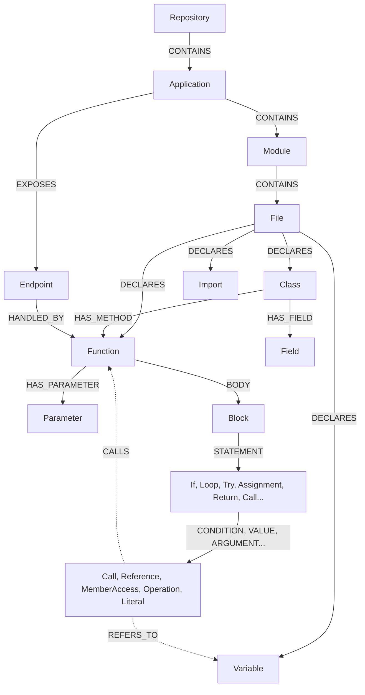
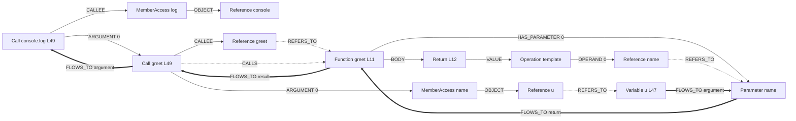
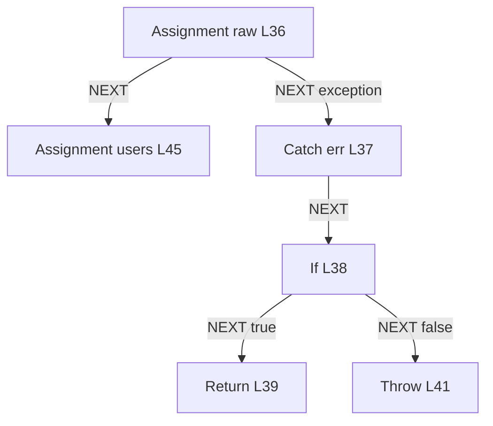
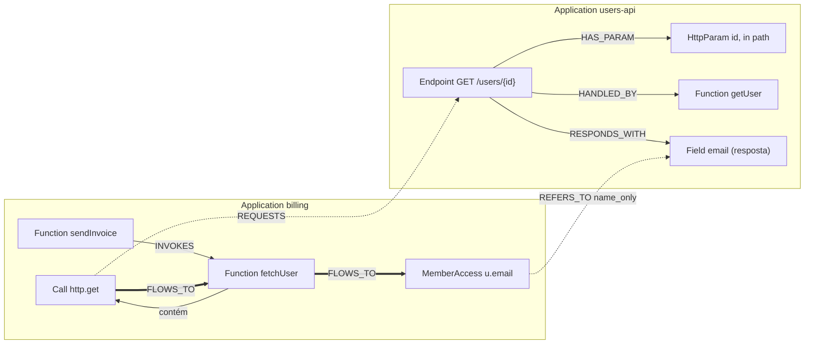

# Revisão do modelo de grafo — nodes, edges e navegação de impacto

Análise de `entity/node.go` (versão atual, não commitada) e proposta inicial
para `entity/edge.go`, tendo como objetivo um grafo que reflita o código a
ponto de responder "o que é impactado se eu alterar X?", inclusive entre
aplicações mapeadas no mesmo banco.

Os exemplos usam o `sample.js` de `tree-sitter-example.md` (as linhas citadas
como `L36` são as linhas daquele arquivo de exemplo). As consultas estão em
Cypher apenas como notação; nada aqui depende de um banco específico.

---

## 1. Veredito

**Os nodes atuais ainda não são suficientes**, e o que falta não é quantidade
de structs, são três conceitos:

1. **Declaração × uso.** Hoje existe `Variable`, mas não existe o node que
   representa *cada lugar onde a variável aparece*. Sem ele não há como
   responder "onde é lida", "onde é passada como parâmetro", "que operação é
   feita sobre ela". É o maior buraco do modelo.
2. **Relações como edges, não como campos.** `If.Condition string`, e as
   sugestões de `Body []Node` / `Children()` de `node-map.md`, descrevem uma
   árvore em memória. Para um grafo persistido, o struct deve carregar só
   propriedades escalares; tudo que aponta para outro node vira edge.
3. **Camada de fluxo derivada.** A AST diz *o que está escrito*. Impacto
   exige *por onde o valor passa* (argumento → parâmetro → retorno → variável)
   e *quem chama quem*. Essas arestas não saem direto da AST; são calculadas
   numa segunda fase e materializadas.

Ao mesmo tempo, o modelo tem nodes demais em alguns pontos: `ArrowFunction`,
`Else`, `AugmentedAssignment`, `Constant`, `Condition`, `Header`/`QueryParam`
podem ser propriedades ou edges de nodes que já existem.

O restante do documento detalha: as camadas do grafo (§2), o feedback struct
por struct (§3), o catálogo proposto de nodes (§4) e edges (§5), exemplos de
mapeamento (§6), o caso entre aplicações (§7), como a navegação de impacto
funciona (§8), o pipeline de extração (§9), limites (§10) e a ordem sugerida
de implementação com o esboço de `edge.go` (§11).

---

## 2. As cinco camadas do grafo

O mesmo conjunto de nodes é ligado por cinco famílias de edges. Cada família
responde a um tipo de pergunta, e separar as famílias é o que mantém as
travessias baratas.

| Camada | Pergunta que responde | Origem | Exemplos de edge |
| --- | --- | --- | --- |
| **Estrutura** | Onde isso mora? | sistema de arquivos + AST | `CONTAINS`, `DECLARES`, `HAS_PARAMETER`, `HAS_FIELD` |
| **Sintaxe** | O que está escrito aqui? | AST (1 arquivo) | `CONDITION`, `THEN`, `ARGUMENT`, `TARGET`, `VALUE`, `OPERAND` |
| **Resolução** | Esse nome é quem? | análise de escopo/import (N arquivos) | `REFERS_TO`, `CALLS`, `INSTANTIATES`, `HAS_TYPE`, `RESOLVES_TO` |
| **Fluxo** | O que executa depois? Para onde o valor vai? | derivada das anteriores | `NEXT`, `FLOWS_TO`, `INVOKES` |
| **Contrato** | Quem fala com quem fora do processo? | regras por framework | `EXPOSES`, `HANDLED_BY`, `REQUESTS`, `PROVIDED_BY` |



Linhas cheias saem da extração de um arquivo; linhas tracejadas dependem de
resolução.

---

## 3. Feedback sobre `entity/node.go`

### 3.1 Veredito por struct

| Struct atual | Veredito | O que fazer |
| --- | --- | --- |
| `Repository` | manter | `Type NodeType` parece querer dizer github/bitbucket; isso é outro conceito, use `Provider string` e `URL` |
| `Application` | manter | `Code string` é ambíguo (sigla? código-fonte?); renomear para algo como `Key` |
| `Module` | manter, corrigir papel | Module agrupa **Files**, não endpoints. Quem expõe endpoint é a `Application` |
| — | **falta `File`** | É o dono de `Location`, a unidade de re-extração e a porta de entrada de um diff |
| `Endpoint` | manter | Adicionar `Method`; `Path` normalizado (`/users/{id}`) para permitir casamento entre apps |
| `Function` | manter, absorver outros | Adicionar `Kind` (declaration, arrow, method, constructor, anonymous), `Exported`, `External` |
| `ArrowFunction` | **remover** | É `Function{Kind: arrow}`. Para travessia, não há diferença |
| `Call` | manter | Adicionar `Kind` (call, new), `Awaited`, `CalleeText` (texto bruto, útil quando não resolve) |
| `Condition` | **remover** | Ver §3.2 |
| `If` | manter | Trocar `Condition string` por edge `CONDITION`; pode manter `ConditionText` só para exibição |
| `Else` | **remover** | É a edge `ELSE` saindo do `If` para um `Block` (ou para outro `If`, no `else if`) |
| `While`, `For` | **fundir em `Loop`** | `Loop{Kind: while, do_while, for, for_each}`; mesma forma, mesmas edges |
| `Switch`, `Case` | manter | `Case{IsDefault}`; edges `CONDITION` e `BODY` |
| `Break`, `Continue` | fundir em `Jump` | Ver §3.2 |
| `Try`, `Catch` | manter | `finally` vira edge `FINALLY` para um `Block`; `Catch` declara uma `Variable` (o `err`) |
| `Return`, `Throw` | manter | Edge `VALUE` para a expressão |
| `Location` | manter como metadado | Correto não ser node. Precisa de `FileID` + linha/coluna inicial e final |
| `Assignment` | manter | Propriedade `Operator` (`=`, `+=`, ...) e `Kind` (init, assign) |
| `AugmentedAssignment` | **remover** | Ver §3.2 |
| `Variable` | manter | Adicionar `Kind` (const, let, var, catch, loop) |
| `Constant` | **fundir em `Variable`** | `Variable{Kind: const}`; evita duplicar toda regra de resolução e de fluxo |
| `Parameter` | manter | É a junção do fluxo entre funções. Precisa de `Index`, `Name`, `Variadic`, `HasDefault` |
| `Header`, `QueryParam`, `HttpParam` | **fundir em um** | Ver §3.2 |
| `Enum` | manter | Falta `EnumMember` |
| `Field` | manter | Central para impacto de contrato de dados |
| `DataStructure` | **não virar node** | Ver §3.2 |
| `Interface` | manter | |
| `Object` | **dividir** | `Class` (declaração), `ObjectLiteral` (expressão `{a: 1}`), e instância = `Call{Kind: new}` + edge `INSTANTIATES` |

### 3.2 Respostas às dúvidas anotadas no código

**`Condition` — "metadado ou node?"** Nenhum dos dois: é uma *edge*. A
condição de um `if` é uma expressão qualquer (`Operation`, `Call`,
`MemberAccess`...) que já existe como node; o `If` aponta para ela com
`CONDITION`. Assim as referências e chamadas dentro da condição entram no
grafo como quaisquer outras, e "quais decisões dependem de `CONFIG.retries`?"
vira uma travessia comum.

**`Continue` — "necessário?"** Só para a camada de fluxo de controle. Para
impacto o valor é baixo. Sugestão: um único `Jump{Kind: break, continue}`,
barato, e só ligado quando as edges `NEXT` forem implementadas.

**`AugmentedAssignment` — "ou só o assignment com algum tipo de edge?"** Só
o `Assignment`, com `Operator`. A diferença real de `x += 1` para `x = 1` é
que o alvo é **lido e escrito**; isso fica na `Reference` do alvo
(`Access: read_write`), não em outro tipo de node.

**`HttpParam` — "seria realmente necessário?"** Um deles é; os três não.
Um único `HttpParam{In: path, query, header, body, cookie}` (a mesma
convenção do OpenAPI). Ele pertence à camada de contrato: é o que outra
aplicação enxerga. Vale a pena porque é exatamente onde o impacto cruza a
fronteira entre aplicações.

**`DataStructure` — "?"** Tipos primitivos como node criam *supernodes*:
`string` teria uma edge para cada variável de cada aplicação, e ninguém
pergunta "o que é impactado se `string` mudar". Guardar o primitivo como
propriedade (`TypeName: "string"`) em `Variable`/`Parameter`/`Field` e
reservar a edge `HAS_TYPE` para tipos declarados pelo usuário (`Class`,
`Interface`, `Enum`).

**Spans e logs.** Boa ideia, mas não como tipo especial de função. A
chamada que emite (`logger.info(...)`, `tracer.startSpan(...)`) já é um
`Call`; o que falta é um node `Telemetry{Kind: log, span; Template}` ligado
por `EMITS`. O `Template` (a mensagem sem os valores interpolados) é a chave
de busca: dado um log de produção, casa-se o template, chega-se ao `Call`, à
`Function` e ao resto do grafo. Os identificadores de jornada seriam
atributos desse node, ligados à variável de onde saem. Pode ficar para
depois; não muda o desenho do resto.

### 3.3 Problemas de Go no arquivo atual

- **Campo e método com o mesmo nome não compilam.** `Node` exige `ID()` e
  `Type()`, mas os structs têm campos `ID` e `Type`; `Code` exige
  `Location()`, mas `Function` e `Call` têm campo `Location`. Go rejeita
  ("field and method with the same name"). `node-review.md` já apontava isso
  para `Location`; a mudança atual estendeu o problema para `ID`.
- **Nenhum struct implementa `Node` ou `Code`.** Um struct base embutido
  resolve os dois pontos (esboço em §11).
- **`Repository.Type NodeType`** reaproveita o tipo de node para o provedor
  do repositório.
- **Só existe a constante `FunctionNode`.** Cada struct precisa da sua.

---

## 4. Catálogo de nodes proposto

Propriedades comuns a todo node de código: `ID`, `Type`, `Location`,
`FileID`, `ApplicationID` e `OwnerID` (a função, ou o file, que contém o
node). Os dois últimos são redundantes com a estrutura, mas evitam subir a
AST edge por edge toda vez que se quer saber "em que função / aplicação isso
está".

### Estrutura e contrato

| Node | Propriedades | Observação |
| --- | --- | --- |
| `Repository` | `URL`, `Provider` | |
| `Application` | `Name`, `Key` | |
| `Module` | `Name`, `Path` | pacote/diretório |
| `File` | `Path`, `Language`, `Hash` | `Hash` permite pular arquivos não alterados |
| `Package` | `Name`, `Version` | dependência externa (`node:fs/promises`, `axios`); ver §7.2 |
| `Endpoint` | `Method`, `Path` | abstração, não é código |
| `HttpParam` | `Name`, `In`, `TypeName`, `Required` | contrato do endpoint |

### Declarações (os "símbolos")

| Node | Propriedades | Observação |
| --- | --- | --- |
| `Function` | `Name`, `Kind`, `Async`, `Exported`, `External` | métodos e arrows incluídos |
| `Parameter` | `Name`, `Index`, `Variadic`, `HasDefault`, `TypeName` | |
| `Variable` | `Name`, `Kind`, `TypeName` | const/let/var/catch/loop |
| `Class` | `Name`, `Exported` | |
| `Interface` | `Name`, `Exported` | |
| `Field` | `Name`, `TypeName` | de `Class`, `Interface` ou `ObjectLiteral` |
| `Enum`, `EnumMember` | `Name`, `Value` | |
| `Import` | `Local`, `Imported`, `Source`, `Kind` | o nome local que o arquivo passa a enxergar |

### Statements

| Node | Propriedades | Edges de saída (sintaxe) |
| --- | --- | --- |
| `Block` | — | `STATEMENT{index}` |
| `If` | `ConditionText` | `CONDITION`, `THEN`, `ELSE` |
| `Loop` | `Kind` | `INIT`, `CONDITION`, `UPDATE`, `ITERABLE`, `BODY` |
| `Switch` / `Case` | `IsDefault` | `CONDITION`, `CASE{index}`, `BODY` |
| `Try` / `Catch` | — | `BODY`, `CATCH`, `FINALLY` |
| `Assignment` | `Operator`, `Kind` | `TARGET`, `VALUE` |
| `Return` / `Throw` | — | `VALUE` |
| `Jump` | `Kind`, `Label` | — |

### Expressões

| Node | Propriedades | Edges de saída (sintaxe) |
| --- | --- | --- |
| `Call` | `Kind`, `Awaited`, `CalleeText` | `CALLEE`, `ARGUMENT{index}` |
| `Reference` | `Name`, `Access` (read, write, read_write) | — (ganha `REFERS_TO` na resolução) |
| `MemberAccess` | `Property`, `Computed` | `OBJECT` |
| `Operation` | `Operator`, `Kind` (binary, unary, logical, ternary, template) | `OPERAND{index}` |
| `Literal` | `Kind`, `Value` | — |
| `ObjectLiteral` | `Kind` (object, array) | `HAS_FIELD`, `ELEMENT{index}` |

### Por que `Reference` é um node e não só uma edge

A alternativa mais compacta seria ligar o `Call` direto à `Variable` usada
como argumento. `Reference` como node custa mais (será o tipo mais numeroso
do grafo), mas compensa por três motivos:

1. **A extração de um arquivo fica autocontida.** A fase por arquivo emite
   `Reference{Name: "readFile"}` sem precisar saber quem é `readFile`; a
   resolução depois só *acrescenta* a edge `REFERS_TO`. Sem o node, a
   extração por arquivo dependeria de outros arquivos já estarem processados.
2. **Nome não resolvido continua representado.** Globais (`console`,
   `JSON`), código dinâmico e bibliotecas não mapeadas ficam como
   `Reference` sem `REFERS_TO`, em vez de sumirem.
3. **Cada uso tem localização e papel próprios.** "Onde `raw` é lida?" é
   uma lista de nodes com linha e coluna, e o papel de cada uso é a edge de
   sintaxe que chega nele (`ARGUMENT`, `OPERAND`, `CONDITION`, `TARGET`...).

Do que `node-map.md` lista, fica fora desta proposta: `Comment`, `Shebang`,
`RegexLiteral`, `Decorator`, `Spread`, `Label`, literais discriminados por
tipo e `Scope` como node. Nada disso muda uma resposta de impacto; pode
entrar depois sem alterar o desenho.

---

## 5. Catálogo de edges

`{index}` indica que a edge carrega a posição, porque a ordem importa.

### Estrutura

| Edge | De → Para | Significado |
| --- | --- | --- |
| `CONTAINS` | Repository → Application → Module → File | hierarquia física |
| `DECLARES` | File, Block, Function → Function, Class, Variable, Interface, Enum, Import | escopo onde o símbolo nasce |
| `HAS_PARAMETER{index}` | Function → Parameter | |
| `HAS_FIELD` | Class, Interface, ObjectLiteral → Field | |
| `HAS_METHOD` | Class, Interface → Function | |
| `HAS_MEMBER` | Enum → EnumMember | |
| `EXPORTS` | File → declaração | o que o arquivo oferece para fora |

### Sintaxe (papéis dentro de uma construção)

| Edge | De → Para |
| --- | --- |
| `BODY` | Function, Loop, Case, Try, Catch → Block |
| `STATEMENT{index}` | Block → statement |
| `CONDITION` | If, Loop, Switch, Case → expressão |
| `THEN`, `ELSE` | If → Block (ou If, no `else if`) |
| `CASE{index}`, `CATCH`, `FINALLY` | Switch → Case; Try → Catch; Try → Block |
| `INIT`, `UPDATE`, `ITERABLE` | Loop → expressão/declaração |
| `TARGET`, `VALUE` | Assignment → expressão; Return, Throw, Field → expressão |
| `CALLEE`, `ARGUMENT{index}` | Call → expressão |
| `OBJECT` | MemberAccess → expressão |
| `OPERAND{index}`, `ELEMENT{index}` | Operation → expressão; ObjectLiteral(array) → expressão |

Usar um tipo de edge por papel (em vez de um `CHILD` genérico com
propriedade `role`) torna o filtro por tipo de edge o próprio filtro da
consulta, que é o que bancos de grafo otimizam.

### Resolução

| Edge | De → Para | Significado |
| --- | --- | --- |
| `REFERS_TO` | Reference → Variable, Parameter, Function, Class, Import; MemberAccess → Field, Function | este uso é daquele símbolo |
| `RESOLVES_TO` | Import → declaração exportada (ou stub externo) | liga arquivos |
| `IMPORTS` | File → File, Package | resumo em nível de arquivo |
| `CALLS` | Call → Function | alvo da chamada |
| `INSTANTIATES` | Call{new} → Class | |
| `HAS_TYPE` | Variable, Parameter, Field → Class, Interface, Enum | só tipos declarados |
| `RETURNS_TYPE` | Function → Class, Interface, Enum | |
| `EXTENDS`, `IMPLEMENTS` | Class → Class, Interface | |
| `OVERRIDES` | Function → Function | método que substitui o da superclasse |

### Fluxo (derivadas)

| Edge | De → Para | Significado |
| --- | --- | --- |
| `NEXT{branch}` | statement → statement | fluxo de controle; `branch`: true, false, case, exception, loop_back |
| `FLOWS_TO{kind, via}` | portador de valor → portador de valor | o valor de A pode chegar em B |
| `INVOKES` | Function → Function | resumo de `CALLS`: alguma chamada dentro de A tem B como alvo |

`FLOWS_TO` liga apenas **portadores de valor**: `Variable`, `Parameter`,
`Field`, `Call` (o resultado da chamada) e `Function` (o valor retornado).
`via` guarda o ID do statement que causou o fluxo, para a resposta poder
mostrar a linha. Regras de derivação:

| `kind` | Código | Edge gerada |
| --- | --- | --- |
| `assign` | `x = a + b` | `a → x`, `b → x` |
| `argument` | `f(a)`, `f` resolvida | `a → Parameter 0 de f` |
| `argument` | `g(a)`, `g` não resolvida ou externa | `a → Call g(...)` |
| `return` | `return a` dentro de `f` | `a → Function f` |
| `result` | `f(...)` com `CALLS` para `f` | `Function f → Call f(...)` |
| `field` | `obj.f = a` | `a → Field f` |
| `iteration` | `for (const u of users)` | `users → u` |
| `capture` | closure que lê variável do escopo externo | `Variable → Function` (a closure) |

É uma aproximação por símbolo: não distingue a ordem das escritas nem o
ponto de chamada. Erra para mais (aponta impacto que pode não existir), o
que é o lado seguro para análise de impacto.

### Contrato e observabilidade

| Edge | De → Para | Significado |
| --- | --- | --- |
| `EXPOSES` | Application → Endpoint | |
| `HANDLED_BY` | Endpoint → Function | |
| `HAS_PARAM` | Endpoint → HttpParam | |
| `BINDS` | HttpParam → Variable, Parameter, MemberAccess | onde o handler lê o parâmetro |
| `RESPONDS_WITH` | Endpoint → Field, Class | forma da resposta |
| `REQUESTS` | Call → Endpoint | chamada HTTP de saída casada com um endpoint mapeado |
| `PROVIDED_BY` | Package → Application | a dependência é outra aplicação mapeada |
| `DEPENDS_ON` | Application → Application | resumo derivado de `REQUESTS` e `PROVIDED_BY` |
| `EMITS` | Call → Telemetry | |

### Propriedade de confiança

Toda edge de resolução, fluxo e contrato deve carregar `Resolution`:

- `exact` — resolvido por escopo/import, sem ambiguidade;
- `inferred` — resolvido por tipo inferido ou por casamento de rota;
- `name_only` — casado só pelo nome (último recurso).

O algoritmo de impacto usa isso para separar "certamente impactado" de
"possivelmente impactado".

---

## 6. Exemplos de mapeamento

### 6.1 Declaração com valor inicial

```js
const CONFIG = { path: "./data.json", retries: 3 };   // L5
```

| Node | Propriedades |
| --- | --- |
| `Variable` v1 | `Name: CONFIG`, `Kind: const` |
| `Assignment` a1 | `Operator: =`, `Kind: init` |
| `ObjectLiteral` o1 | `Kind: object` |
| `Field` f1, f2 | `Name: path`; `Name: retries` |
| `Literal` l1, l2 | `"./data.json"`; `3` |

```
File      -DECLARES->  v1
a1        -TARGET->    v1
a1        -VALUE->     o1
o1        -HAS_FIELD-> f1  -VALUE-> l1
o1        -HAS_FIELD-> f2  -VALUE-> l2
```

Uma declaração com inicializador gera `Variable` **e** `Assignment`. Assim
"todas as escritas em X" é uma consulta só, sem caso especial para a
declaração. Quando o alvo é a própria declaração, `TARGET` aponta direto
para a `Variable`; nas atribuições seguintes aponta para uma `Reference`.

### 6.2 Chamada, argumentos e atribuição

```js
raw = await readFile(CONFIG.path, "utf8");   // L36
```

| Node | Propriedades |
| --- | --- |
| `Assignment` a2 | `Operator: =`, `Kind: assign` |
| `Reference` r1 | `Name: raw`, `Access: write` |
| `Call` c1 | `Kind: call`, `Awaited: true` |
| `Reference` r2 | `Name: readFile`, `Access: read` |
| `MemberAccess` m1 | `Property: path` |
| `Reference` r3 | `Name: CONFIG`, `Access: read` |
| `Literal` l3 | `"utf8"` |

```
Sintaxe (sai da AST deste arquivo):
  a2 -TARGET->       r1
  a2 -VALUE->        c1
  c1 -CALLEE->       r2
  c1 -ARGUMENT{0}->  m1
  c1 -ARGUMENT{1}->  l3
  m1 -OBJECT->       r3

Resolução (segunda fase):
  r1 -REFERS_TO->    Variable raw (L33)
  r3 -REFERS_TO->    Variable CONFIG (L5)
  m1 -REFERS_TO->    Field path (L6)
  r2 -REFERS_TO->    Import readFile (L2)
  Import readFile -RESOLVES_TO-> Function readFile {External: true}
  c1 -CALLS->        Function readFile {External: true}

Fluxo (derivado):
  Field path -FLOWS_TO{argument, via c1}-> c1
  c1         -FLOWS_TO{assign, via a2}->   Variable raw
```

Com isso já se responde, sem heurística:

- onde `raw` é declarada → `Variable raw`, L33;
- onde é escrita → `Reference` com `Access: write` que `REFERS_TO` ela (L36);
- de onde vem o valor → `FLOWS_TO` de entrada: o resultado de `readFile`;
- o que influencia esse valor → um passo atrás: `CONFIG.path`.

### 6.3 Chamada aninhada e passagem de parâmetro

```js
function greet(name) { return `hello, ${name}`; }   // L11
...
console.log(greet(u.name));                          // L49
```



Linha cheia: sintaxe. Tracejada: resolução. Grossa: fluxo derivado.

A passagem de parâmetro é a composição de três fatos: o `Call` tem
`ARGUMENT{0}`; o `Call` tem `CALLS` para `greet`; `greet` tem
`HAS_PARAMETER{0}`. Casando o índice, a derivação emite
`Variable u → Parameter name`. Seguindo as edges grossas: o valor de `u`
entra em `greet` como `name`, compõe o retorno, volta para o ponto de
chamada e é entregue a `console.log`.

`console` não resolve para nada (é global): a `Reference` fica sem
`REFERS_TO` e o `Call` sem `CALLS`, mas ambos continuam no grafo com
`CalleeText: "console.log"`.

### 6.4 Controle de fluxo

```js
try {
  raw = await readFile(CONFIG.path, "utf8");   // L36
} catch (err) {                                // L37
  if (err.code === "ENOENT") {                 // L38
    return [];                                 // L39
  } else {
    throw err;                                 // L41
  }
}
const users = JSON.parse(raw);                 // L45
```

```
Sintaxe:
  Try   -BODY->      Block -STATEMENT{0}-> Assignment (L36)
  Try   -CATCH->     Catch
  Catch -DECLARES->  Variable err
  Catch -BODY->      Block -STATEMENT{0}-> If (L38)
  If    -CONDITION-> Operation{===}
                       -OPERAND{0}-> MemberAccess code -OBJECT-> Reference err
                       -OPERAND{1}-> Literal "ENOENT"
  If    -THEN->      Block -STATEMENT{0}-> Return (L39) -VALUE-> ObjectLiteral{array}
  If    -ELSE->      Block -STATEMENT{0}-> Throw  (L41) -VALUE-> Reference err
```



As edges `NEXT` dizem o que as de sintaxe não dizem: a linha 45 só executa
se a 36 não lançar, e existe uma saída antecipada de `loadUsers` que retorna
`[]`. É o que permite perguntar "sob quais condições este trecho roda?":
sobe-se pelas `NEXT` ao contrário, coletando os `If`/`Loop`/`Catch` do
caminho e o rótulo do ramo tomado.

### 6.5 Classe, campo e chamada de método

```js
class Counter {
  constructor(start = 0) { this.value = start; }        // L20-22
  inc() { this.value += 1; return this.value; }         // L24-27
}
...
const c = new Counter();                                // L32
c.inc();                                                // L48
```

```
Estrutura:
  Class Counter -HAS_METHOD-> Function constructor {Kind: constructor}
  Class Counter -HAS_METHOD-> Function inc {Kind: method}
  Class Counter -HAS_FIELD->  Field value
  Function constructor -HAS_PARAMETER{0}-> Parameter start {HasDefault: true}

this.value = start (L21):
  Assignment{=}  -TARGET-> MemberAccess value {Access: write} -OBJECT-> Reference this
  Assignment{=}  -VALUE->  Reference start
  MemberAccess value -REFERS_TO-> Field value
  Parameter start -FLOWS_TO{field}-> Field value

this.value += 1 (L25):
  Assignment{+=} -TARGET-> MemberAccess value {Access: read_write}
  Assignment{+=} -VALUE->  Literal 1

const c = new Counter() (L32):
  Call{Kind: new} -CALLEE->       Reference Counter -REFERS_TO-> Class Counter
  Call{Kind: new} -INSTANTIATES-> Class Counter
  Call{Kind: new} -CALLS->        Function constructor
  Variable c      -HAS_TYPE->     Class Counter            {Resolution: inferred}

c.inc() (L48):
  Call -CALLEE-> MemberAccess inc -OBJECT-> Reference c -REFERS_TO-> Variable c
  MemberAccess inc -REFERS_TO-> Function inc               {Resolution: inferred}
  Call -CALLS->                 Function inc               {Resolution: inferred}
```

Pontos a notar:

- Em JS o campo `value` não tem declaração própria; nasce da primeira
  atribuição a `this.value`. O extrator cria o `Field` ao ver esse padrão
  dentro de uma classe.
- `c.inc()` só resolve porque `c` recebeu o tipo `Counter` via `new`.
  Sem tipo, a chamada ficaria `name_only` (qualquer método chamado `inc`)
  ou sem `CALLS`. É aqui que linguagem dinâmica cobra o preço; ver §10.
- "Quem altera `Counter.value`?" → `MemberAccess` com `Access` de escrita
  que `REFERS_TO` o `Field`: L21 e L25.

### 6.6 Função passada como valor

```js
const double = (n) => n * 2;      // L16
...
return users.map(double);         // L56
```

```
Variable double -(Assignment init)-> Function {Kind: arrow}
Function (arrow) -HAS_PARAMETER{0}-> Parameter n
Function (arrow) -BODY-> Operation{*} -OPERAND{0}-> Reference n
                                      -OPERAND{1}-> Literal 2

Call map (L56) -CALLEE->       MemberAccess map -OBJECT-> Reference users
Call map (L56) -ARGUMENT{0}->  Reference double -REFERS_TO-> Variable double
Variable double -FLOWS_TO{argument}-> Call map
Function loadUsers -INVOKES-> Function (arrow)   {Resolution: inferred}
```

Aqui `double` não é chamada: aparece como `Reference` em posição de
`ARGUMENT`, não de `CALLEE`. Quem a chama é `map`, que é externa. A regra
prática: função passada como argumento é tratada como potencialmente
invocada por quem recebe, e gera `INVOKES` com `Resolution: inferred`.
Sem essa regra, callbacks, handlers de rota e middlewares somem do grafo de
chamadas, e são justamente os pontos de entrada.

---

## 7. Entre aplicações

### 7.1 Via HTTP

```js
// users-api/src/routes.js
router.get("/users/:id", getUser);

// users-api/src/handlers.js
async function getUser(req, res) {
  const user = await repo.findById(req.params.id);
  res.json({ id: user.id, email: user.email });
}
```

```js
// billing/src/client.js
async function fetchUser(id) {
  const r = await http.get(`${USERS_API}/users/${id}`);
  return r.data;
}

// billing/src/invoice.js
async function sendInvoice(order) {
  const u = await fetchUser(order.userId);
  mailer.send(u.email, buildInvoice(order));
}
```



Como cada edge nasce:

- **`Endpoint` + `HANDLED_BY`**: regra por framework. Em Express, um `Call`
  cujo `CALLEE` é `router.get` (ou `post`, `put`...), com `ARGUMENT{0}`
  literal de rota e `ARGUMENT{1}` referência a função. O path é normalizado
  (`/users/:id` → `/users/{id}`).
- **`HttpParam` + `BINDS`**: leituras de `req.params.X`, `req.query.X`,
  `req.headers.X` dentro do handler.
- **`RESPONDS_WITH`**: os `Field` do `ObjectLiteral` passado a `res.json`.
- **`REQUESTS`**: um `Call` para cliente HTTP conhecido (`axios`, `fetch`,
  `http.get`) cujo argumento de URL, depois de trocar interpolações por
  curingas, casa com método + path de um `Endpoint` no banco. A base da URL
  (`USERS_API`) identifica a aplicação quando há um mapa de configuração;
  sem ele, casa-se só pelo path, com `Resolution: inferred`.

O mesmo desenho serve para outros meios: um node `Topic` com `PUBLISHES` /
`SUBSCRIBES` para mensageria, e um node `Table` com `READS_FROM` /
`WRITES_TO` para banco compartilhado. Em todos, o acoplamento entre
aplicações passa por um node de contrato, nunca por uma edge direta de
código para código.

### 7.2 Via biblioteca compartilhada

Quando `billing` importa `@acme/auth` e esse pacote é outra aplicação
mapeada, `Package @acme/auth -PROVIDED_BY-> Application auth-lib`, e os
`Import` de `billing` passam a `RESOLVES_TO` as `Function` reais de
`auth-lib` em vez de stubs externos. A partir daí `CALLS`, `INVOKES` e
`FLOWS_TO` atravessam a fronteira como se fosse um arquivo do mesmo projeto.

---

## 8. Navegação: da alteração ao impacto

### 8.1 Entrada: do diff ao node

Uma alteração chega como arquivo + intervalo de linhas. O primeiro passo é
sempre o mesmo: achar os nodes cuja `Location` cruza o intervalo e ficar com
os mais específicos.

```cypher
MATCH (f:File {path: $path})
MATCH (n {fileId: f.id})
WHERE n.startLine <= $endLine AND n.endLine >= $startLine
RETURN n ORDER BY (n.endLine - n.startLine) ASC
```

Por isso `Location` precisa estar em todo node de código e `fileId` +
`startLine` precisam de índice.

### 8.2 Que edges seguir, por tipo de alteração

O algoritmo de impacto é uma busca em largura em que o tipo do node
alterado decide quais edges seguir e em que direção.

| O que mudou | Seguir | Chega em |
| --- | --- | --- |
| Corpo de `Function` | `INVOKES` ao contrário; `HANDLED_BY` ao contrário | chamadores, endpoints que a expõem |
| Assinatura de `Function` | `CALLS` ao contrário | cada ponto de chamada, com linha |
| `Parameter` (remoção, ordem, tipo) | `CALLS` ao contrário + `ARGUMENT{index}` | a expressão passada em cada chamada |
| Valor de `Variable` | `FLOWS_TO` para frente | tudo que recebe o valor |
| Nome/remoção de `Variable` | `REFERS_TO` ao contrário | todos os usos |
| `Field` | `REFERS_TO` ao contrário; `FLOWS_TO` para frente; `RESPONDS_WITH` ao contrário | leituras, escritas, endpoints que o devolvem |
| `Class` / `Interface` | `HAS_TYPE`, `INSTANTIATES`, `EXTENDS`, `IMPLEMENTS` ao contrário | variáveis, instâncias, subclasses |
| Método sobrescrito | `OVERRIDES` nos dois sentidos | implementações irmãs |
| `Endpoint` / `HttpParam` | `REQUESTS` ao contrário | chamadas em outras aplicações |
| Export de um `File` | `RESOLVES_TO` ao contrário | imports em outros arquivos e apps |

Ao chegar num `Call` ou `Reference`, sobe-se para a função dona via
`OwnerID` e a busca continua a partir dela. Condições de parada: limite de
profundidade, node já visitado, e corte em edges `name_only` quando se quer
só impacto certo.

### 8.3 Consultas de exemplo

**Quem chama `greet`, até os endpoints:**

```cypher
MATCH (f:Function {name: "greet"})<-[:INVOKES*1..6]-(caller:Function)
OPTIONAL MATCH (caller)<-[:HANDLED_BY]-(e:Endpoint)<-[:EXPOSES]-(app:Application)
RETURN caller.name, e.method, e.path, app.name
```

**Pontos de chamada que quebram se `greet` ganhar um parâmetro obrigatório:**

```cypher
MATCH (f:Function {name: "greet"})<-[:CALLS]-(c:Call)
RETURN c.fileId, c.startLine, c.calleeText
```

**Para onde vai o valor de `CONFIG.path`:**

```cypher
MATCH (fld:Field {name: "path"})-[:FLOWS_TO*1..8]->(x)
RETURN labels(x), x.name, x.fileId, x.startLine
```

No exemplo: `Field path → Call readFile → Variable raw → Call JSON.parse →
Variable users → Variable u → Parameter name → Function greet → Call greet →
Call console.log`. A pergunta "se eu trocar o caminho do arquivo de
configuração, o que é afetado?" vira uma lista ordenada de linhas.

**Que decisões dependem de `CONFIG.retries`:**

```cypher
MATCH (fld:Field {name: "retries"})<-[:REFERS_TO]-(m:MemberAccess)
MATCH (ctrl)-[:CONDITION]->(expr)-[:OPERAND|OBJECT*0..4]->(m)
RETURN labels(ctrl), ctrl.fileId, ctrl.startLine
```

Resultado: o `Loop{while}` de L52.

**Impacto em outras aplicações ao mudar `getUser`:**

```cypher
MATCH (f:Function {name: "getUser"})<-[:HANDLED_BY]-(e:Endpoint)
MATCH (e)<-[r:REQUESTS]-(c:Call)
MATCH (caller:Function {id: c.ownerId})<-[:INVOKES*0..6]-(up:Function)
MATCH (app:Application {id: up.applicationId})
RETURN app.name, up.name, c.fileId, c.startLine, r.resolution
```

Resultado: `billing`, `fetchUser` (direto) e `sendInvoice` (transitivo).

### 8.4 Por que isso é mais efetivo que busca textual

- **Distingue homônimos.** Os dois `name` do exemplo (parâmetro de `greet`
  e propriedade `u.name`) são nodes diferentes; um grep devolve ambos.
- **Segue renomeações.** `CONFIG.path` vira `raw`, vira `users`, vira `u`,
  vira `name`; nenhuma busca por nome acompanha isso, `FLOWS_TO` acompanha.
- **Dá direção.** "Quem me afeta" e "quem eu afeto" são a mesma edge
  percorrida em sentidos opostos.
- **Gradua a certeza.** `Resolution` separa o que é fato do que é suspeita.
- **Atravessa aplicações** pelo mesmo mecanismo, via nodes de contrato.

---

## 9. Pipeline de extração

| Fase | Entrada | Saída | Escopo |
| --- | --- | --- | --- |
| 1. Extração | AST de um arquivo | nodes + edges de estrutura e sintaxe; `Reference` e `Import` sem resolver | 1 arquivo, paralelizável |
| 2. Resolução | nodes de uma aplicação | `REFERS_TO`, `RESOLVES_TO`, `CALLS`, `INSTANTIATES`, `HAS_TYPE` | 1 aplicação |
| 3. Derivação | grafo resolvido | `NEXT`, `FLOWS_TO`, `INVOKES` | 1 aplicação |
| 4. Contrato | regras por framework | `Endpoint`, `HttpParam`, `HANDLED_BY`, `BINDS` | 1 aplicação |
| 5. Ligação | todas as aplicações | `REQUESTS`, `PROVIDED_BY`, `DEPENDS_ON` | banco inteiro |

O tree-sitter cobre só a fase 1: ele entrega sintaxe, não sabe quem é
`readFile`. A fase 2 é onde está o trabalho difícil (escopos, hoisting,
imports, e inferência de tipo para chamadas de método) e é específica por
linguagem. Antes de escrever um resolvedor por linguagem, vale avaliar
índices prontos de definição/referência, como SCIP (`scip-typescript`,
`scip-go`, `scip-python`): eles entregam justamente os pares "este uso →
aquela definição" com precisão de compilador, e podem alimentar `REFERS_TO`
diretamente.

### IDs

O ID decide se a re-extração de um arquivo quebra edges vindas de fora.

- **Declarações** (`Function`, `Class`, `Variable` de topo, `Field`,
  `Endpoint`): ID pelo nome qualificado, por exemplo
  `app:src/users.js#loadUsers`. Sobrevive a edições no arquivo, então as
  edges de outros arquivos e aplicações reencaixam sozinhas.
- **Nodes internos** (`Call`, `Reference`, `If`...): ID por
  `função dona + tipo + ordinal`, ou hash da posição. Mudam a cada edição, e
  tudo bem: são sempre apagados e recriados junto com o arquivo.

Re-extração incremental: apagar todos os nodes com aquele `FileID`,
reinserir, e refazer as fases 2 e 3 para o arquivo e para quem o importa.

---

## 10. Limites e riscos

- **Linguagem dinâmica.** Em JS/Python sem tipos, `obj.metodo()` muitas
  vezes não resolve. O grafo precisa aceitar `Call` sem `CALLS` e marcar o
  que for palpite. TypeScript, Go e Java resolvem muito melhor.
- **Despacho dinâmico.** Chamada por interface pode cair em qualquer
  implementação. Tratamento usual: `CALLS` para o método da interface e a
  travessia expande por `IMPLEMENTS` / `OVERRIDES`.
- **Casamento de URL.** URLs montadas em tempo de execução ou vindas de
  configuração podem não casar com endpoint nenhum. Um mapa explícito
  "variável de ambiente → aplicação" resolve boa parte.
- **Supernodes.** Além dos primitivos (§3.2), funções utilitárias como
  `logger.info` acumulam milhares de `CALLS`. A travessia de impacto deve
  ter uma lista de nodes pelos quais não se propaga.
- **Volume.** `Reference` e `Literal` serão a maioria dos nodes. Se pesar,
  o primeiro corte é não criar `Literal` para valores que não sejam rota,
  nome de tópico, SQL ou template de log.
- **Imprecisão do `FLOWS_TO`.** Por ser por símbolo, mistura todos os
  pontos de chamada de uma função. Aceitável para impacto; insuficiente para
  análise de segurança (taint), que exigiria sensibilidade a contexto.
- **Reflexão, `eval`, injeção de dependência por string.** Fora do alcance
  da análise estática; regras por framework cobrem os casos comuns.

---

## 11. Próximos passos

Ordem sugerida, cada passo entregando algo consultável:

1. **Base de nodes e edges**: struct base, `File`, `Location` preenchida,
   constantes de `NodeType`, `Edge`. Corrige os problemas de §3.3.
2. **Estrutura + declarações** de uma linguagem: `File`, `Function`,
   `Parameter`, `Class`, `Field`, `Variable`, `Import`. Já responde "o que
   existe e onde".
3. **`Call` + `Reference` + `MemberAccess`**, com resolução dentro do
   arquivo e por import. Entrega `CALLS` / `INVOKES`: o grafo de chamadas,
   que sozinho cobre a maior parte das perguntas de impacto.
4. **`Assignment`, `Return`, `Operation` e `FLOWS_TO`**: fluxo de dados.
5. **`Endpoint`, `HttpParam`, `REQUESTS`**: impacto entre aplicações.
6. **Statements de controle e `NEXT`**; depois `Telemetry`.

Controle de fluxo fica por último de propósito: é a parte mais detalhada do
`node.go` atual, mas a que menos contribui para análise de impacto.

### Esboço de base para `node.go`

```go
type Base struct {
	NodeID   string
	NodeType NodeType
}

func (b Base) ID() string     { return b.NodeID }
func (b Base) Type() NodeType { return b.NodeType }

// CodeBase é embutido por todo node que vem do código-fonte
type CodeBase struct {
	Base
	Loc     Location
	OwnerID string // função (ou file) que contém o node
}

func (c CodeBase) Location() Location { return c.Loc }

type Location struct {
	FileID    string
	StartLine int
	StartCol  int
	EndLine   int
	EndCol    int
}

type Function struct {
	CodeBase
	Name     string
	Kind     string // declaration, arrow, method, constructor, anonymous
	Async    bool
	Exported bool
	External bool
}
```

### Esboço de `edge.go`

```go
package entity

type EdgeType string

const (
	// estrutura
	ContainsEdge     = EdgeType("CONTAINS")
	DeclaresEdge     = EdgeType("DECLARES")
	HasParameterEdge = EdgeType("HAS_PARAMETER")
	HasFieldEdge     = EdgeType("HAS_FIELD")
	HasMethodEdge    = EdgeType("HAS_METHOD")
	ExportsEdge      = EdgeType("EXPORTS")

	// sintaxe
	BodyEdge      = EdgeType("BODY")
	StatementEdge = EdgeType("STATEMENT")
	ConditionEdge = EdgeType("CONDITION")
	ThenEdge      = EdgeType("THEN")
	ElseEdge      = EdgeType("ELSE")
	CalleeEdge    = EdgeType("CALLEE")
	ArgumentEdge  = EdgeType("ARGUMENT")
	TargetEdge    = EdgeType("TARGET")
	ValueEdge     = EdgeType("VALUE")
	ObjectEdge    = EdgeType("OBJECT")
	OperandEdge   = EdgeType("OPERAND")

	// resolução
	RefersToEdge     = EdgeType("REFERS_TO")
	ResolvesToEdge   = EdgeType("RESOLVES_TO")
	CallsEdge        = EdgeType("CALLS")
	InstantiatesEdge = EdgeType("INSTANTIATES")
	HasTypeEdge      = EdgeType("HAS_TYPE")
	ExtendsEdge      = EdgeType("EXTENDS")
	ImplementsEdge   = EdgeType("IMPLEMENTS")

	// fluxo (derivadas)
	NextEdge    = EdgeType("NEXT")
	FlowsToEdge = EdgeType("FLOWS_TO")
	InvokesEdge = EdgeType("INVOKES")

	// contrato
	ExposesEdge   = EdgeType("EXPOSES")
	HandledByEdge = EdgeType("HANDLED_BY")
	HasParamEdge  = EdgeType("HAS_PARAM")
	RequestsEdge  = EdgeType("REQUESTS")
)

type Resolution string

const (
	Exact    = Resolution("exact")
	Inferred = Resolution("inferred")
	NameOnly = Resolution("name_only")
)

type Edge struct {
	From string
	To   string
	Type EdgeType

	// Posição quando a ordem importa (ARGUMENT, STATEMENT, OPERAND, HAS_PARAMETER)
	Index int
	// Subtipo: branch do NEXT (true, false, exception) ou kind do FLOWS_TO (assign, argument, return)
	Kind string
	// ID do statement que originou uma edge derivada
	Via string
	// Preenchido nas edges de resolução, fluxo e contrato
	Resolution Resolution
}
```
